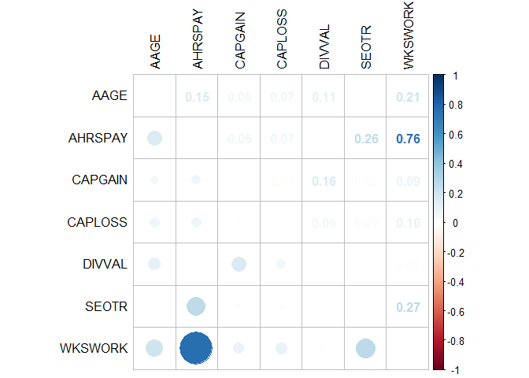
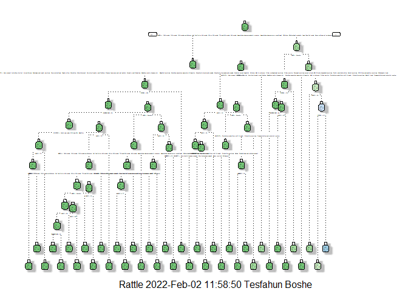
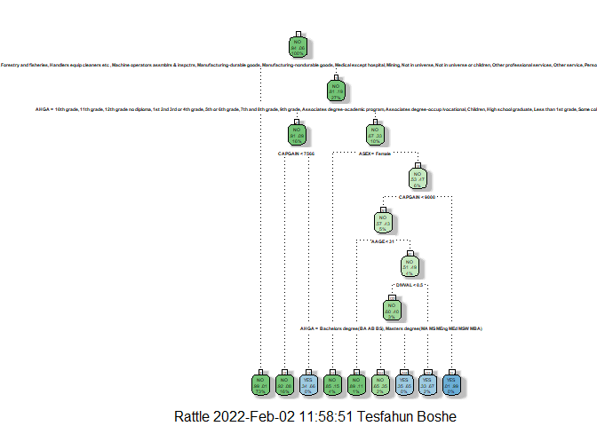
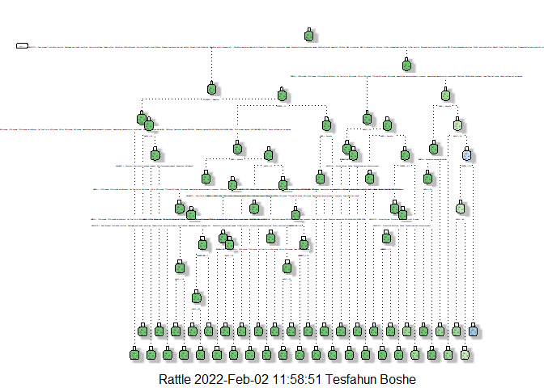
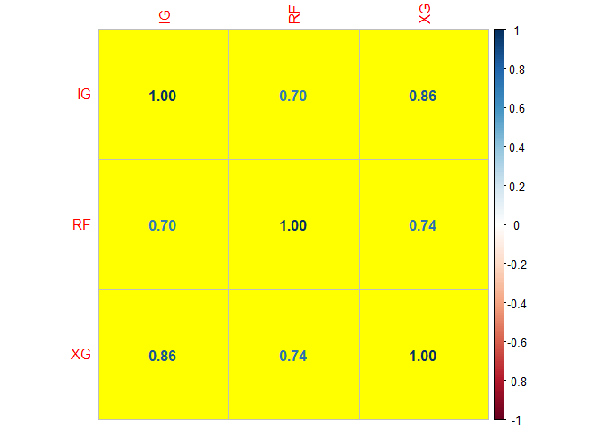
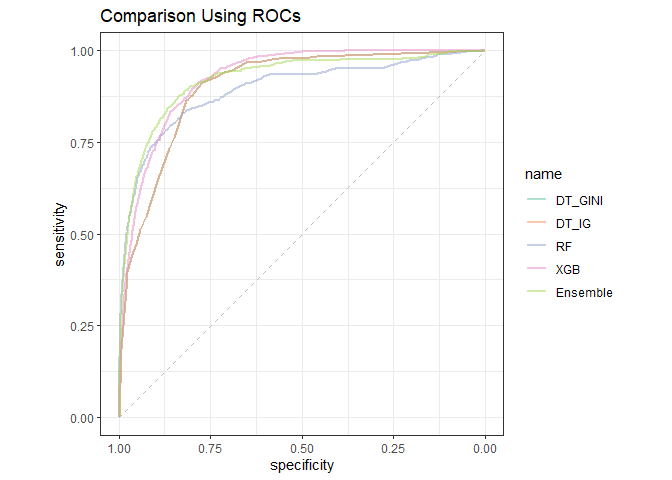

# Introduction

**The Problem statement**

Classification is a supervised machine learning algorithm of assigning a class label based on known examples. There are many different types of classification tasks requiring machine learning approaches such as those to be discussed below. In this document, we will try to predict a person's income based on census data.

The predictions will be either above 50K or below 50K. Since the dependent variable is of a categorical type, we have a classification problem at hand. 

While there are numerous techniques of classification, we will apply the following three and compare the results: Classification trees andrandom forests. We will also test if ensembling those algorithms with bagging, boosting and stacking improve the results.

**1. Classification Trees**
Decision trees can be used for classification problem. The two most common approaches are:using Gini purity/coefficient and using information gain (IG), measured by entropy (1-entropy)

**2. Random Forests**

Random forest is a supervised learning algorithm/model that uses a large number of ensembled decision trees on data samples. Each tree in the forest makes a prediction and the best solution is selected based on voting. This model is common for its simplicity and diversity hence, the combination of the multiple decision trees is likely to get a more accurate and stable prediction.

**4. Ensembling **
Ensembling is combining predictions from various models to improve the result. It is using multiple learning algorithms to obtain better predictive performance than could be obtained from any of the constituent learning algorithms alone. Some of the ensembling methods are to be covered: 

**a. Bagging (Bootstrap Averaging)**

Bagging improves the stability and accuracy of machine learning algorithms. It also reduces variance since it is a way of filtering out the output with specail way of averaging. 

**b. Boosting of decision trees**
Boosting algorithms reduce bias, and also variance converting weak learners to strong ones. There are many boosting algorithms, however, we will use XGBost, an abbreviation for Extreme Gradient Boosting

**XGBost: Extreme Gradient Boosting**
 It is also called regularized boosting method. Some of its important features are intelligent tree prunning, Newton-Raphson approximation, Additional randomization parameter and parallelization. 


**c. Majority Voting **
- Majority prediction from the ensembled models is considered the best prediction. 

**Data source**

The source data comes from Census-Income (KDD) Data Set available [Here](https://archive.ics.uci.edu/ml/datasets/Census-Income+%28KDD%29)
The data set is divided into a train and test sets, each with 22 columns, some of which are categorical.


# Exploratory data analysis
Before we get to the modeling itself, we will analyse the data at hand. 

## Data preparation
Installing the necessary packages 

```r
requiredPackages = c("e1071","randomForest","caretEnsemble","verification","olsrr","DescTools","caret","tibble","purrr","corrplot","dbplyr","dplyr","readr", "ggplot2", "tidyverse","tree","rpart","rpart.plot","rattle","here", "pROC","xgboost","neuralnet")

for(i in requiredPackages){if(!require(i,character.only = TRUE)) install.packages(i)}
for(i in requiredPackages){if(!require(i,character.only = TRUE)) library(i,character.only = TRUE)}
```


Load the data

```r
data_train <- read.csv("CensusData_Train.csv")
data_test <- read.csv("CensusData_Test.csv")
```

Data summary

```r
str(data_train)
```

```
## 'data.frame':	32723 obs. of  21 variables:
##  $ AAGE    : int  73 58 18 9 10 48 42 28 47 34 ...
##  $ ACLSWKR : chr  " Not in universe" " Self-employed-not incorporated" " Not in universe" " Not in universe" ...
##  $ AHRSPAY : int  0 4 0 0 0 40 34 4 43 4 ...
##  $ AHGA    : chr  " High school graduate" " Some college but no degree" " 10th grade" " Children" ...
##  $ AHSCOL  : chr  " Not in universe" " Not in universe" " High school" " Not in universe" ...
##  $ AMARITL : chr  " Widowed" " Divorced" " Never married" " Never married" ...
##  $ AMJOCC  : chr  " Not in universe" " Precision production craft & repair" " Not in universe" " Not in universe" ...
##  $ ARACE   : chr  " White" " White" " Asian or Pacific Islander" " White" ...
##  $ AREORGN : chr  " All other" " All other" " All other" " All other" ...
##  $ ASEX    : chr  " Female" " Male" " Female" " Female" ...
##  $ AUNMEM  : chr  " Not in universe" " Not in universe" " Not in universe" " Not in universe" ...
##  $ AWKSTAT : chr  " Not in labor force" " Children or Armed Forces" " Not in labor force" " Children or Armed Forces" ...
##  $ CAPGAIN : int  0 0 0 0 0 0 5178 0 0 0 ...
##  $ CAPLOSS : int  0 0 0 0 0 0 0 0 0 0 ...
##  $ DIVVAL  : int  0 0 0 0 0 0 0 0 0 0 ...
##  $ FILESTAT: chr  " Nonfiler" " Head of household" " Nonfiler" " Nonfiler" ...
##  $ PENATVTY: chr  " United-States" " United-States" " Vietnam" " United-States" ...
##  $ PRCITSHP: chr  " Native- Born in the United States" " Native- Born in the United States" " Foreign born- Not a citizen of U S " " Native- Born in the United States" ...
##  $ SEOTR   : int  0 0 0 0 0 2 0 0 0 0 ...
##  $ WKSWORK : int  0 52 0 0 0 52 52 30 52 52 ...
##  $ PTOTVAL : chr  "-50000" "-50000" "-50000" "-50000" ...
```

Let's check our target variable,*PTOTVAL*

```r
table(data_train$PTOTVAL)
```

```
## 
##   -50000  50000+. 
##    30767     1956
```

*PTOTVAL* is an ordinal categorical variable with two levels (-50000,50000+). 


```r
# is.factor(data_train$PTOTVAL)
data_train$PTOTVAL <- factor(data_train$PTOTVAL,
                           levels = c(" 50000+.","-50000"), #level 5000 is set as the first one
                           ordered = TRUE) # ordinal


table(data_train$PTOTVAL)
```

```
## 
##  50000+.   -50000 
##     1956    30767
```

**Missing values and outliers**

Let's find if any entries are missing


```r
sum(is.na(data_train))
```

```
## [1] 0
```

```r
sapply(data_train, function(x) sum(is.na(x)))
```

```
##     AAGE  ACLSWKR  AHRSPAY     AHGA   AHSCOL  AMARITL   AMJOCC    ARACE 
##        0        0        0        0        0        0        0        0 
##  AREORGN     ASEX   AUNMEM  AWKSTAT  CAPGAIN  CAPLOSS   DIVVAL FILESTAT 
##        0        0        0        0        0        0        0        0 
## PENATVTY PRCITSHP    SEOTR  WKSWORK  PTOTVAL 
##        0        0        0        0        0
```
> This is not quite true, becasue we know the missing values were represented by a question mark. 

Let's check by variable. 


```r
sapply(data_train, function(x) sum(x==" ?"))
```

```
##     AAGE  ACLSWKR  AHRSPAY     AHGA   AHSCOL  AMARITL   AMJOCC    ARACE 
##        0        0        0        0        0        0        0        0 
##  AREORGN     ASEX   AUNMEM  AWKSTAT  CAPGAIN  CAPLOSS   DIVVAL FILESTAT 
##        0        0        0        0        0        0        0        0 
## PENATVTY PRCITSHP    SEOTR  WKSWORK  PTOTVAL 
##      525        0        0        0        0
```

Variable *PENATVTY* has missing values. 
We will will remove those observations. 


```r
data_train <- data_train[!data_train$PENATVTY == " ?",]
```

**Categorical and numeric variables**

a. Categorical variables

```r
categorical_vars <- 
  sapply(data_train, is.character) %>% 
  which() %>% 
  names()

categorical_vars
```

```
##  [1] "ACLSWKR"  "AHGA"     "AHSCOL"   "AMARITL"  "AMJOCC"   "ARACE"   
##  [7] "AREORGN"  "ASEX"     "AUNMEM"   "AWKSTAT"  "FILESTAT" "PENATVTY"
## [13] "PRCITSHP"
```

Let's change all categorical variables into factors. 

```r
data_train[categorical_vars] <- lapply(data_train[categorical_vars],factor)
```

Now we can check the list of levels for each variable. The output is hidden since too long. 

```r
lapply(data_train[categorical_vars],levels)
```

Setting contrast

```r
options(contrasts = c("contr.treatment",  # for non-ordinal factors
                      "contr.treatment")) # for ordinal factors
```

a. Numeric variables

```r
numeric_vars <- 
  sapply(data_train, is.numeric) %>% 
  which() %>% 
  names()

numeric_vars
```

```
## [1] "AAGE"    "AHRSPAY" "CAPGAIN" "CAPLOSS" "DIVVAL"  "SEOTR"   "WKSWORK"
```

# Classification methods
In this stage, we will apply the classification techniques discussed in the introduction. Before that, however, we will need to select from the variables.

## Variable selection
Before applying the classification techniques, we will once again go through the variables and select only those that will positively contribute to our model accuracy. Large size of variables can be beneficial to find the true causality relationship, however, it may make the calculations very expensive or sometimes over-fitting may happen. 

### Selecting from numeric variables
Generally, it is advisable to remove variables with a *single level (zero variance)*, variables which are *linear combinations* of each other and variables with *very large correlation* with others. Let's do that one by one.

**1. Removing variables with 1 level**


```r
sapply(data_train[, numeric_vars], 
        function(x) 
          unique(x) %>% 
          length()) %>% 
  sort()
```

```
##   SEOTR AHRSPAY WKSWORK CAPLOSS    AAGE CAPGAIN  DIVVAL 
##       3      52      53      88      91     120     649
```

> No variables with 1 level. 

**2. Removing highly correlated variables**

If we have two highly correlated variables, we remove one from the model. Because they supply redundant information, removing one of the correlated factors usually doesn't drastically reduce the R-squared.

```r
correlations <- cor(data_train[, numeric_vars],
    use = "pairwise.complete.obs")
```

Plotting the correlations

```r
# using the 30 most correlated variables
corrplot.mixed(correlations,
               upper = "number",
               lower = "circle",
               tl.col = "black",
               tl.pos = "lt")
```

<!-- -->

> We see that there are variables *WKSWORK* ( weeks worked in a year) and *AHRSPAY* (wage per hour) have the highest correlation.  We can remove one of them, however, since the correlation is only 75%, we keep both of them 

3. Removing linear combinations


```r
( findLinearCombos(data_train[,numeric_vars] ) ->
    linearCombos )
```

```
## $linearCombos
## list()
## 
## $remove
## NULL
```

> None of the numberic variables is/are in linear combinations with the other/s. 

### Selecting from categorical variables
We can use general regression model to apply logistic regression. Then we will compare the p - values. 

We will need to prepare the dependent variable for this.  

```r
data_train$PTOTVAL <- ifelse(data_train$PTOTVAL=="-50000",0,1)
categorical_vars_all <- c(categorical_vars,"PTOTVAL") # add the dependent variable to the catergorical variables list. 
```


```r
model <- lm(PTOTVAL ~ ., 
                 data = data_train[categorical_vars_all])

# summary(model)
```
> Each level of a categorical variable is treated as  a separate variable. However, all variables are removed together if insignificant. 

**Automated elimination**

Backward elimination is general to specific approaching, where the model starts with all available variables, and then runs the model again and again, in each step removing 1 least significant variable. The process stops when a model with all variables significant is achieved. Other automated options are step-wise elimination and forward elimination. 


```r
ols_step_backward_p(model,
                    prem = 0.05,
                    # show progress
                    progress = FALSE) -> backward_selector
```

List of removed variables. 

```r
backward_selector$removed
```

```
## [1] "ARACE"    "PRCITSHP" "AREORGN"
```

> Variables *PRCITSHP*, *AREORGN*,*ARACE* are selected for removal. 

The remaining categorical variables


```r
categorical_vars_all <- categorical_vars_all[!categorical_vars_all %in% backward_selector$removed]
```

Let's combine the selected variables. 

```r
selectedvars <- c(categorical_vars_all ,numeric_vars)
```

Changing the target variable to a factor of "YES", and "NO". 

```r
data_train$PTOTVAL <- as.factor(ifelse(data_train$PTOTVAL==1,"YES","NO"))
```

## Preparing the test data

Let's load the data. 

```r
data_test <- read.csv("CensusData_Test.csv")
```


We have to apply all the changes we made to the train data to the test data too. 

1. Remove rows with question mark for variable **

```r
data_test <- data_test[!data_test$PENATVTY == " ?",]
```

2. Change all categorical variables to factors.

```r
data_test[categorical_vars] <- lapply(data_test[categorical_vars],factor)
```

3. Change the dependent variable to binary levels ("NO","YES")

```r
data_test$PTOTVAL <- as.factor(ifelse(data_test$PTOTVAL=="-50000","NO","YES"))
```

## Models
Now that we have selected the variables, we can start modeling. 

### Decision Trees for classification

**A. Using GINI coefficient as the split criterion**


```r
set.seed(234356) # seeding for reproducibility

model_GINI <- rpart(PTOTVAL ~ ., # model formula
                    data = data_train[selectedvars], # data
                    method = "class", # type of the tree: classification
                    parms = list(split = 'gini'))  # gini for decision criterion
```

Prediction on the train and test data. 

```r
prediction_train_GINI <- predict(model_GINI, 
                            data_train[selectedvars[!selectedvars %in% "PTOTVAL"]],type = "prob")

prediction_test_GINI <- predict(model_GINI, 
                            data_test[selectedvars[!selectedvars %in% "PTOTVAL"]],type = "prob")
```

What if we played a little bit with the tree complexity, stopping criteria and prunning parameters?

```r
model_GINI_final <- rpart(PTOTVAL ~ ., # model formula
                          data = data_train[selectedvars], # data
                          method = "class", # type of the tree: classification
                          parms = list(split = 'gini'),  # gini for decision criterion
                          minsplit = 800, # chosen after multiple attempts
                          minbucket = 400, # chosen after multiple attempts
                          maxdepth = 20, # chosen after multiple attempts
                          cp = -1
                    
                   )
```

Prediction on the train and test data. 

```r
prediction_train_GINI_final <- predict(model_GINI_final, 
                            data_train[selectedvars[!selectedvars %in% "PTOTVAL"]],type = "prob")

prediction_test_GINI_final <- predict(model_GINI_final, 
                            data_test[selectedvars[!selectedvars %in% "PTOTVAL"]],type = "prob")
```

**B. Using Information Gain as the split criterion**


```r
model_IG <- rpart(PTOTVAL ~ ., # model formula
                    data = data_train[selectedvars], # data
                    method = "class", # type of the tree: classification
                    parms = list(split = 'information'))  # entropy for decision criterion
```

Prediction on the train and test data. 

```r
prediction_train_IG <- predict(model_GINI_final, 
                            data_train[selectedvars[!selectedvars %in% "PTOTVAL"]],type = "prob")

prediction_test_IG <- predict(model_GINI_final, 
                            data_test[selectedvars[!selectedvars %in% "PTOTVAL"]],type = "prob")
```


With some modification of the parameters: 

```r
model_IG_final <- rpart(PTOTVAL ~ ., # model formula
                    data = data_train[selectedvars], # data
                    method = "class", # type of the tree: classification
                    parms = list(split = 'information'),  # entropy for decision criterion
                    minsplit = 800, # chosen after multiple attempts
                    minbucket = 400,# chosen after multiple attempts
                    maxdepth = 20, # chosen after multiple attempts
                    cp = -1 )
```

Prediction on the train and test data. 

```r
prediction_train_IG_final <- predict(model_GINI_final, 
                            data_train[selectedvars[!selectedvars %in% "PTOTVAL"]],type = "prob")

prediction_test_IG_final <- predict(model_GINI_final, 
                            data_test[selectedvars[!selectedvars %in% "PTOTVAL"]],type = "prob")
```

### Comparison using Model Plots {.tabset}

#### model_GINI


```r
fancyRpartPlot(model_GINI)
```

<!-- -->

#### model_GINI_final


```r
fancyRpartPlot(model_GINI_final)
```

<!-- -->

#### model_IG


```r
fancyRpartPlot(model_IG)
```

<!-- -->

#### model_IG_final


```r
fancyRpartPlot(model_IG_final)
```

<!-- -->


### Random Forests


```r
set.seed(12345)
model_RF <- randomForest(PTOTVAL ~ .,
                           data = data_train[selectedvars])
```

Prediction on the train and test data. 
Let's do some trick to equalize the classes of training and test sets. 


```r
data_test <- rbind(data_train[1, ] , data_test)
data_test <- data_test[-1,]
```

Prediction

```r
prediction_train_RF <- predict(model_RF,
                            data_train[selectedvars[!selectedvars %in% "PTOTVAL"]],type = "prob")

prediction_test_RF <- predict(model_RF,
                            data_test[selectedvars[!selectedvars %in% "PTOTVAL"]],type = "prob")
```

#### Comparison of the models on performance

Let's define a function that decodes the predicted probability values to binary levels,(0,1), and then calculates the model accuracy statistics from the confusion matrix it creates. 


```r
summary_binary <- function(predicted_probs,
                           real = data_test$PTOTVAL,
                           binary = TRUE,
                           cutoff = 0.5,
                           level_positive = "YES",
                           level_negative = "NO") {

  if(binary){
    ctable <- confusionMatrix(as.factor(ifelse(predicted_probs >= cutoff, 
                                             level_positive, 
                                             level_negative)), 
                            real, 
                            level_positive) 
  }
  if(!binary){
    ctable <- confusionMatrix(as.factor(predicted_probs), 
                            real, 
                            level_positive) 
  }

  stats <- round(c(ctable$overall[1],
                   ctable$byClass[c(1:4, 7, 11)]),5)
  return(stats)
}
```


Using the function created above, we can compare the test-data predictions of the above models and determine the best performing model for the stages to follow. 


```r
# predictions <- c(prediction_test_GINI_final[,2], prediction_test_IG_final[,2], prediction_test_RF[,2])
# statistics_by_model <- lapply(predictions, summary_binary)
stats_GINI <- summary_binary(prediction_test_GINI_final[,2])
stats_IG <- summary_binary(prediction_test_IG_final[,2])
stats_RF <- summary_binary(prediction_test_RF[,2])
(stats_ALL <- rbind(stats_GINI,stats_IG,stats_RF))
```

```
##            Accuracy Sensitivity Specificity Pos Pred Value Neg Pred Value
## stats_GINI  0.94363     0.18552     0.99431        0.68562        0.94808
## stats_IG    0.94363     0.18552     0.99431        0.68562        0.94808
## stats_RF    0.95010     0.46516     0.98252        0.64010        0.96489
##                 F1 Balanced Accuracy
## stats_GINI 0.29202           0.58992
## stats_IG   0.29202           0.58992
## stats_RF   0.53878           0.72384
```

Comparing the results, we see that model_RF works the best. model_IG_final, however, will be used for bagging algorithm as it is faster and does not achieve any worse accuracy.  

### Bagging (bootstrap averaging)

We will model_IG_final from above steps and apply bagging algorithms to see if the accuracy will improve. 

We will create 15 models from samples of the data. (Odd to make it easier for majority voting). 

```r
n <- nrow(data_train[selectedvars])

results_bagging <- list() # collect resulting models

for (sample in 1:15) {
  # we draw n-element sample (with replacement) 
  set.seed(12345 + sample)
  data_sample <- 
    data_train[selectedvars][sample(x = 1:n, 
                         size = n,
                         replace = TRUE),]

  results_bagging[[sample]] <-  rpart(PTOTVAL ~ ., # model formula
                                      data = data_train[selectedvars], # data
                                      method = "class", # type of the tree: classification
                                      parms = list(split = 'information'),  # entropy for decision criterion
                                      minsplit = 800, # chosen after multiple attempts
                                      minbucket = 400,# chosen after multiple attempts
                                      maxdepth = 20, # chosen after multiple attempts
                                      cp = -1 )
  
  rm(data_sample)
}
```


```r
prediction_bagging <- 
  sapply(results_bagging,
         function(x) 
           predict(object = x,
                   newdata = data_test[selectedvars[!selectedvars %in% "PTOTVAL"]], # exclude the target variable
                   type = "class")) %>% 
  data.frame()

prediction_bagging <- (prediction_bagging=="YES")*1
```


**Majority voting**
Majority voting -  (If more than half votes for a *YES*, it is a *YES*)

```r
prediction_bagging_YESNO <- ifelse(rowSums(prediction_bagging) > 7.5,
       "YES", "NO") %>% 
factor(., levels = c("YES", "NO"))
```

Let's compare the result to the results of  model_IG_final, using confusion matrix.

```r
(metrics_IG_final <- confusionMatrix(data = as.factor(ifelse(prediction_test_IG_final[,2]> 0.5,"YES", "NO")),
                reference =data_test$PTOTVAL,
                positive = "YES"))
```

```
## Confusion Matrix and Statistics
## 
##           Reference
## Prediction    NO   YES
##        NO  16435   900
##        YES    94   205
##                                          
##                Accuracy : 0.9436         
##                  95% CI : (0.9401, 0.947)
##     No Information Rate : 0.9373         
##     P-Value [Acc > NIR] : 0.0002464      
##                                          
##                   Kappa : 0.2726         
##                                          
##  Mcnemar's Test P-Value : < 2.2e-16      
##                                          
##             Sensitivity : 0.18552        
##             Specificity : 0.99431        
##          Pos Pred Value : 0.68562        
##          Neg Pred Value : 0.94808        
##              Prevalence : 0.06266        
##          Detection Rate : 0.01163        
##    Detection Prevalence : 0.01696        
##       Balanced Accuracy : 0.58992        
##                                          
##        'Positive' Class : YES            
## 
```


```r
(metrics_bagging <- confusionMatrix(data = prediction_bagging_YESNO,
                reference =data_test$PTOTVAL,
                positive = "YES"))
```

```
## Confusion Matrix and Statistics
## 
##           Reference
## Prediction    NO   YES
##        NO  16523  1088
##        YES     6    17
##                                           
##                Accuracy : 0.938           
##                  95% CI : (0.9343, 0.9415)
##     No Information Rate : 0.9373          
##     P-Value [Acc > NIR] : 0.3736          
##                                           
##                   Kappa : 0.0277          
##                                           
##  Mcnemar's Test P-Value : <2e-16          
##                                           
##             Sensitivity : 0.015385        
##             Specificity : 0.999637        
##          Pos Pred Value : 0.739130        
##          Neg Pred Value : 0.938220        
##              Prevalence : 0.062663        
##          Detection Rate : 0.000964        
##    Detection Prevalence : 0.001304        
##       Balanced Accuracy : 0.507511        
##                                           
##        'Positive' Class : YES             
## 
```

> Comment: Unfortunately bagging did not improve the prediction accuracy. 

### Boosting of decision trees
Boosting is a sequentially additive model improvement algorithm, where each subsequent model improves the results of the previous ones. 
There are multiple boosting algorithms. Some of the boosting methods are GBM (Gradient Boosting Models) and XGBoost (Extreme Gradient Boosting).We will apply XGBoost algorithm and compare to the results we obtained above. 

**XGBoost: Extreme Gradient Boosting **

finding optimal values of tree parameters. We will run the model over the range of parameter cominations. Every round of running will keep all but one parameter constant. This way we will be able to tell the parameter achieving the best result. 


```r
control <- trainControl(method = "cv", # using cross validation
                         number = 3,
                         classProbs = TRUE,
                         summaryFunction = twoClassSummary,
                         savePredictions = "final")

# testing for various values of min_child_weight
parameters_grid <- expand.grid(nrounds = 80,  
                              max_depth = seq(5, 15, 2),
                              eta = c(0.25), 
                              gamma = 1,
                              colsample_bytree = c(0.2),
                              min_child_weight = seq(200, 1000, 200),
                              subsample = 0.8)

set.seed(123456789)
model_1 <- train(PTOTVAL ~ .,
                      data = data_train[selectedvars],
                      method = "xgbTree", #XGBoost
                      trControl = control,
                      tuneGrid  = parameters_grid)


model_1
```

```
## eXtreme Gradient Boosting 
## 
## 32198 samples
##    17 predictor
##     2 classes: 'NO', 'YES' 
## 
## No pre-processing
## Resampling: Cross-Validated (3 fold) 
## Summary of sample sizes: 21465, 21465, 21466 
## Resampling results across tuning parameters:
## 
##   max_depth  min_child_weight  ROC        Sens       Spec     
##    5          200              0.9130129  0.9929982  0.2020833
##    5          400              0.8720825  1.0000000  0.0000000
##    5          600              0.8608266  1.0000000  0.0000000
##    5          800              0.8403469  1.0000000  0.0000000
##    5         1000              0.8281555  1.0000000  0.0000000
##    7          200              0.9112341  0.9956073  0.1442708
##    7          400              0.8747587  1.0000000  0.0000000
##    7          600              0.8642195  1.0000000  0.0000000
##    7          800              0.8398235  1.0000000  0.0000000
##    7         1000              0.8224030  1.0000000  0.0000000
##    9          200              0.9138554  0.9933945  0.1958333
##    9          400              0.8791641  1.0000000  0.0000000
##    9          600              0.8712415  1.0000000  0.0000000
##    9          800              0.8516351  1.0000000  0.0000000
##    9         1000              0.8400231  1.0000000  0.0000000
##   11          200              0.9045880  0.9948477  0.1395833
##   11          400              0.8724822  1.0000000  0.0000000
##   11          600              0.8652364  1.0000000  0.0000000
##   11          800              0.8448455  1.0000000  0.0000000
##   11         1000              0.8540381  1.0000000  0.0000000
##   13          200              0.9075618  0.9957724  0.1421875
##   13          400              0.8685340  1.0000000  0.0000000
##   13          600              0.8662442  1.0000000  0.0000000
##   13          800              0.8634769  1.0000000  0.0000000
##   13         1000              0.8371207  1.0000000  0.0000000
##   15          200              0.9098129  0.9943194  0.1546875
##   15          400              0.8780092  1.0000000  0.0000000
##   15          600              0.8595761  1.0000000  0.0000000
##   15          800              0.8546580  1.0000000  0.0000000
##   15         1000              0.8341320  1.0000000  0.0000000
## 
## Tuning parameter 'nrounds' was held constant at a value of 80
## Tuning
##  'colsample_bytree' was held constant at a value of 0.2
## Tuning
##  parameter 'subsample' was held constant at a value of 0.8
## ROC was used to select the optimal model using the largest value.
## The final values used for the model were nrounds = 80, max_depth = 9, eta
##  = 0.25, gamma = 1, colsample_bytree = 0.2, min_child_weight = 200
##  and subsample = 0.8.
```
> Accordingly, max_depth = 9, min_child_weight = 200 


```r
# testing for various values of colsample_bytree 
parameters_grid2 <- expand.grid(nrounds = 80,
                              max_depth = 9,
                              eta = c(0.25), 
                              gamma = 1,
                              colsample_bytree = seq(0.1, 0.8, 0.1),
                              min_child_weight = 200,
                              subsample = 0.8)
set.seed(123456789)
model_2 <- train(PTOTVAL ~ .,
                      data = data_train[selectedvars],
                      method = "xgbTree",
                      trControl = control,
                      tuneGrid  = parameters_grid2)

model_2
```

```
## eXtreme Gradient Boosting 
## 
## 32198 samples
##    17 predictor
##     2 classes: 'NO', 'YES' 
## 
## No pre-processing
## Resampling: Cross-Validated (3 fold) 
## Summary of sample sizes: 21465, 21465, 21466 
## Resampling results across tuning parameters:
## 
##   colsample_bytree  ROC        Sens       Spec      
##   0.1               0.9012159  0.9981175  0.05885417
##   0.2               0.9078584  0.9954422  0.14947917
##   0.3               0.9128974  0.9927670  0.20729167
##   0.4               0.9144973  0.9919083  0.22500000
##   0.5               0.9152333  0.9919744  0.21979167
##   0.6               0.9149041  0.9917102  0.23072917
##   0.7               0.9159420  0.9918423  0.22500000
##   0.8               0.9158877  0.9907854  0.23177083
## 
## Tuning parameter 'nrounds' was held constant at a value of 80
## Tuning
##  held constant at a value of 200
## Tuning parameter 'subsample' was held
##  constant at a value of 0.8
## ROC was used to select the optimal model using the largest value.
## The final values used for the model were nrounds = 80, max_depth = 9, eta
##  = 0.25, gamma = 1, colsample_bytree = 0.7, min_child_weight = 200
##  and subsample = 0.8.
```
> Hence,the best value of colsample_bytree = 0.7

Next we find the optimal sample size. 

```r
# testing for various values of optimal length of the subsample
parameters_grid3 <- expand.grid(nrounds = 80,
                              max_depth = 9,
                              eta = c(0.25), 
                              gamma = 1,
                              colsample_bytree = 0.7,
                              min_child_weight = 200,
                              subsample = c(0.6, 0.7, 0.75, 0.8, 0.85, 0.9))

set.seed(123456789)
model_3 <- train(PTOTVAL ~ .,
                      data = data_train[selectedvars],
                      method = "xgbTree",
                      trControl = control,
                      tuneGrid  = parameters_grid3)

model_3
```

```
## eXtreme Gradient Boosting 
## 
## 32198 samples
##    17 predictor
##     2 classes: 'NO', 'YES' 
## 
## No pre-processing
## Resampling: Cross-Validated (3 fold) 
## Summary of sample sizes: 21465, 21465, 21466 
## Resampling results across tuning parameters:
## 
##   subsample  ROC        Sens       Spec      
##   0.60       0.9051719  0.9979854  0.05677083
##   0.70       0.9132711  0.9922056  0.21718750
##   0.75       0.9115917  0.9916111  0.22083333
##   0.80       0.9158820  0.9919083  0.22604167
##   0.85       0.9173593  0.9912808  0.22864583
##   0.90       0.9204303  0.9918753  0.23645833
## 
## Tuning parameter 'nrounds' was held constant at a value of 80
## Tuning
##  held constant at a value of 0.7
## Tuning parameter 'min_child_weight' was
##  held constant at a value of 200
## ROC was used to select the optimal model using the largest value.
## The final values used for the model were nrounds = 80, max_depth = 9, eta
##  = 0.25, gamma = 1, colsample_bytree = 0.7, min_child_weight = 200
##  and subsample = 0.9.
```
> Optimal subsample = 0.9. 


```r
# lower the learning rate and proportionally increase number of trees

paramters_grid4 <- expand.grid(nrounds = 160, # number of trees increased. 
                              max_depth = 9,
                              eta = 0.12,  # learnign rate lowered
                              gamma = 1,
                              colsample_bytree = 0.7,
                              min_child_weight = 200,
                              subsample = 0.9)

set.seed(2234)
model_XGB <- train(PTOTVAL ~ .,
                      data = data_train[selectedvars],
                      method = "xgbTree",
                      trControl = control,
                      tuneGrid  = paramters_grid4)

model_XGB
```

```
## eXtreme Gradient Boosting 
## 
## 32198 samples
##    17 predictor
##     2 classes: 'NO', 'YES' 
## 
## No pre-processing
## Resampling: Cross-Validated (3 fold) 
## Summary of sample sizes: 21466, 21465, 21465 
## Resampling results:
## 
##   ROC        Sens       Spec     
##   0.9198024  0.9920404  0.2322917
## 
## Tuning parameter 'nrounds' was held constant at a value of 160
## Tuning
##  held constant at a value of 200
## Tuning parameter 'subsample' was held
##  constant at a value of 0.9
```


Prediction on the train and test data. 

```r
prediction_train_XGB <- predict(model_XGB,
                            data_train[selectedvars[!selectedvars %in% "PTOTVAL"]],type = "prob")

prediction_test_XGB <- predict(model_XGB,
                            data_test[selectedvars[!selectedvars %in% "PTOTVAL"]],type = "prob")
```


Checking performance with metrics


```r
(stats_XGB <- summary_binary(prediction_test_XGB[,2]))
```

```
##          Accuracy       Sensitivity       Specificity    Pos Pred Value 
##           0.94255           0.15113           0.99546           0.69008 
##    Neg Pred Value                F1 Balanced Accuracy 
##           0.94607           0.24796           0.57330
```

```r
# How it compares to others
(stats_ALL <- rbind(stats_ALL,stats_XGB))
```

```
##            Accuracy Sensitivity Specificity Pos Pred Value Neg Pred Value
## stats_GINI  0.94363     0.18552     0.99431        0.68562        0.94808
## stats_IG    0.94363     0.18552     0.99431        0.68562        0.94808
## stats_RF    0.95010     0.46516     0.98252        0.64010        0.96489
## stats_XGB   0.94255     0.15113     0.99546        0.69008        0.94607
##                 F1 Balanced Accuracy
## stats_GINI 0.29202           0.58992
## stats_IG   0.29202           0.58992
## stats_RF   0.53878           0.72384
## stats_XGB  0.24796           0.57330
```

### Ensembling
Ensembling is the process of using multiple learning algorithms to obtain better predictive performance than could be obtained from any of the constituent learning algorithms alone. 
This algorithm has the base models as the bottom layer and one final classifier as the top layer model. 

At this stage we will ensemble the models created above. 
Since the models have already been trained, we can create a dataframe with the predictions (of course on the train data) from each of them. 

```r
predictions_train_all <- data.frame(IG = prediction_train_IG_final[,2],
                                 RF = prediction_train_RF[,2],
                                 XG = prediction_train_XGB[,2])
```

We can check the correlation between predictions using correlation plots. 

```r
corrplot::corrplot(cor(predictions_train_all), method="number",bg = "yellow") # all predictions are strongly correlated. 
```

<!-- -->

We need to prepare the data for top layer model definition


```r
train_set <- predictions_train_all 
# Averaging (Majority Voting)
predictions_train_Ensemble <- rowMeans(train_set)
```

Next step is defining the top layer model. 
- the top layer model ensembles the predictions of the base layer models. 


```r
# # let's use  generalized linear model (logistic regression). 
# 
# model_glm<- 
# train(train_set[,1:3],train_set[,4],method='glm')
```

Now the last stage is predicting on the test data using the predictions of the ensembled models. 

Prediction on the test data. 


```r
predictions_test_all <- data.frame(IG = prediction_test_IG_final[,2],
                                 RF = prediction_test_RF[,2],
                                 XG = prediction_test_XGB[,2])
```

Using  Averaging (Majority Voting) for ensembling top layer model 

```r
# Averaging (Majority Voting)
predictions_test_Ensemble <- rowMeans(predictions_test_all)
```

Let's check the performance metrics. 


```r
(stats_Ensemble <- summary_binary(predictions_test_Ensemble))
```

```
##          Accuracy       Sensitivity       Specificity    Pos Pred Value 
##           0.94596           0.21176           0.99504           0.74051 
##    Neg Pred Value                F1 Balanced Accuracy 
##           0.94971           0.32935           0.60340
```
Comparing to the other models: 


```r
(stats_ALL <- rbind(stats_ALL,stats_Ensemble))
```

```
##                Accuracy Sensitivity Specificity Pos Pred Value Neg Pred Value
## stats_GINI      0.94363     0.18552     0.99431        0.68562        0.94808
## stats_IG        0.94363     0.18552     0.99431        0.68562        0.94808
## stats_RF        0.95010     0.46516     0.98252        0.64010        0.96489
## stats_XGB       0.94255     0.15113     0.99546        0.69008        0.94607
## stats_Ensemble  0.94596     0.21176     0.99504        0.74051        0.94971
##                     F1 Balanced Accuracy
## stats_GINI     0.29202           0.58992
## stats_IG       0.29202           0.58992
## stats_RF       0.53878           0.72384
## stats_XGB      0.24796           0.57330
## stats_Ensemble 0.32935           0.60340
```

This absolutely did not improve the model accuracy. 


# Evaluation of Performance

We have analysed the predictions using the summary metrics function defined above.  Next we will compare with ROC curve and area under ROC.

## Using Metrics


```r
stats_ALL
```

```
##                Accuracy Sensitivity Specificity Pos Pred Value Neg Pred Value
## stats_GINI      0.94363     0.18552     0.99431        0.68562        0.94808
## stats_IG        0.94363     0.18552     0.99431        0.68562        0.94808
## stats_RF        0.95010     0.46516     0.98252        0.64010        0.96489
## stats_XGB       0.94255     0.15113     0.99546        0.69008        0.94607
## stats_Ensemble  0.94596     0.21176     0.99504        0.74051        0.94971
##                     F1 Balanced Accuracy
## stats_GINI     0.29202           0.58992
## stats_IG       0.29202           0.58992
## stats_RF       0.53878           0.72384
## stats_XGB      0.24796           0.57330
## stats_Ensemble 0.32935           0.60340
```


## Comparison using ROC curve
An ROC curve plots TPR vs. FPR at different classification thresholds. The area under ROC curve,AUC,can be interpreted as the probability that the model ranks a random positive example more highly than a random negative example. The larger AUC values indicate better models. 


```r
predictionss <- data.frame(DT_GINI = prediction_test_GINI_final[,2],
                  DT_IG = prediction_test_IG_final[,2],
                  RF = prediction_test_RF[,2],
                  XGB = prediction_test_XGB[,2],
                  Ensemble = predictions_test_Ensemble
                  ) 

ROC_data<- lapply(predictionss, roc, response = as.numeric(data_test$PTOTVAL == "YES"))


ROC_data %>%
  pROC::ggroc(alpha = 0.5, linetype = 1, size = 1) + 
  geom_segment(aes(x = 1, xend = 0, y = 0, yend = 1), 
               color = "grey", 
               linetype = "dashed") +
  labs(title = "Comparison Using ROCs") +
  theme_bw() + coord_fixed() +
  scale_color_brewer(palette = "Set2")
```

<!-- -->

## Using Area Under Roc


```r
(AUC_all <- lapply(ROC_data, auc))
```

```
## $DT_GINI
## Area under the curve: 0.9039
## 
## $DT_IG
## Area under the curve: 0.9039
## 
## $RF
## Area under the curve: 0.8939
## 
## $XGB
## Area under the curve: 0.9251
## 
## $Ensemble
## Area under the curve: 0.9212
```


# Conclusion

As can be seen from the ROCs, the models achieve great accuracy values, however, the balanced accuracy is too low. This is due to the fact that the target variable is highly inbalanced, most of the observations earning below 50K. 

Comparing to the methods applied during the ML1 project work (Logit, Probit, Naive Bayes), these methods achieve improved accuracy, but lower balanced accuracy. 

# References
1. Lecture materials from ML2 and ML1 courses
